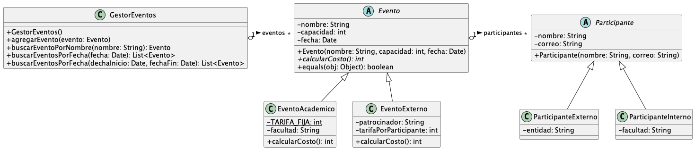

# Taller 11 - Herencia y polimorfismo

En este taller se trabajará la carga y escritura de archivos de texto y binarios. Se trabajará sobre el proyecto de la aplicación de música que se ha venido desarrollando en los talleres anteriores.

## Indice

1. [Preguntas teóricas](#preguntas-teóricas)
2. [Enunciado](#enunciado)
   1. [Nuevo formato de archivos](#nuevo-formato-de-archivos)
3. [Calificación](#calificación)
4. [Recursos en línea](#recursos-en-línea)

## Preguntas teóricas

Marque la respuesta correcta a las siguientes preguntas. Estas preguntas no afectan la calificación del taller, pero le ayudarán a reforzar los conceptos vistos en clase:

1. ¿Cuál es el nombre de la clase de la que heredan todas las clases en Java?
    - Object
    - Class
    - Super
    - Parent
2. ¿Qué ocurre cuando se define un método con el modificador `final` en una clase `A`?
   - El método debe ser implementado en las clases que heredan de `A`.
   - El método solo puede ser usado directamente en cualquier parte, pero no puede ser sobreescrito en las clases del mismo paquete.
   - El método no puede ser sobreescrito en las clases que heredan de `A`.
   - El método debe ser sobrescrito y usado directamente en las clases que heredan de `A`.
3. ¿En qué contexto se usa la palabra reservada `super` en Java?
   - Para llamar al constructor de la clase padre.
   - Para llamar a un método de la clase padre.
   - Para llamar a un atributo de la clase padre.
   - Todas las anteriores.
4. ¿Qué es un método abstracto?
   - Un método que no tiene implementación.
   - Un método que no puede ser sobreescrito.
   - Un método que no puede ser llamado.
   - Un método que no puede ser heredado.
5. ¿Cuántas interfaces puede implementar una clase en Java?
   - Una clase solo puede implementar una interfaz a la vez.
   - Una clase puede implementar varias interfaces a la vez.
   - Una clase no puede implementar interfaces.
   - Una clase puede implementar una interfaz y extender otra clase a la vez.
6. La herencia permite que una clase adquiera los atributos y métodos de otra clase.
   - Verdadero
   - Falso
7. El polimorfismo permite que un objeto se comporte de diferentes formas según el contexto.
   - Verdadero
   - Falso
8. En Java, una clase puede heredar de más de una clase a la vez.
   - Verdadero
   - Falso
9. Una clase abstracta puede heredar de otra clase abstracta.
   - Verdadero
   - Falso
10. Cuál de las siguientes opciones describe correctamente la herencia en programación orientada a objetos:
    - La capacidad de una clase de heredar propiedades y métodos de otra clase.
    - El proceso de encapsular datos y comportamientos en un objeto.
    - La técnica de ocultar detalles internos y mostrar solo la interfaz.
    - La capacidad de un objeto de ser tratado como un de varios tipos posibles.
11. ¿Cuál de las siguientes opciones describe correctamente el polimorfismo en programación orientada a objetos?
    - La capacidad de una clase de heredar propiedades y métodos de otra clase.
    - El proceso de encapsular datos y comportamientos en un objeto.
    - La técnica de ocultar detalles internos y mostrar solo la interfaz.
    - La capacidad de un objeto de ser tratado como un de varios tipos posibles.
12. ¿Cuál de las siguientes afirmaciones sobre las clases abstractas es correcta?
    - Se pueden crear instancias de una clase abstracta.
    - Pueden heredar de multiples clases al mismo tiempo.
    - Pueden contener implementaciones completas de todos sus métodos.
    - Se utilizan como plantillas para crear subclases concretas.
13. ¿Cuál de las siguientes opciones describe mejor el concepto de sobreescritura de métodos?
    - La capacidad de una subclase de proporcionar una implementación diferente para un método heredado de la clase padre.
    - La capacidad de una clase de heredar propiedades y métodos de otra clase.
    - La técnica de ocultar detalles internos y mostrar solo la interfaz.
    - La capacidad de un objeto de ser tratado como un de varios tipos posibles.
14. ¿Cuál de las siguientes afirmaciones sobre las interfaces en Java es correcta?
    - Pueden tener atributos y métodos con implementaciones predeterminadas.
    - Pueden instanciarse directamente.
    - Pueden heredar de otras interfaces y clases.
    - Una clase puede implementar varias interfaces a la vez.

Suponga que tiene el siguiente diagrama de clases:



Responda las preguntas 15 a 17 con base en el diagrama anterior. Si desea profundizar más en un parcial anterior, puede hacerlo [aquí]()

15. ¿Cuáles son los tipos de participantes que se pueden instanciar en el programa?
    - ParticipanteExterno, Participante & ParticipanteInterno
    - ParticipanteExterno & ParticipanteInterno
    - ParticipanteExterno & Participante
    - No se pueden instanciar participantes
16. ¿Cuáles son los tipos de eventos que se pueden instanciar en el programa?
    - Evento, EventoAcademico & EventoExterno
    - EventoAcademico & EventoExterno
    - Evento & EventoExterno
    - No se pueden instanciar eventos
17. ¿Qué tipo de relación existe entre las clases Participante y Evento?
    - Agregación
    - Composición
    - Herencia
    - Ninguna de las anteriores
18. ¿Para qué se usa la palabra reservada `instanceof` en Java?
    - Para verificar si un objeto es una instancia de una clase.
    - Para verificar si un objeto es una instancia de una interfaz.
    - Para verificar si un objeto es una instancia de una clase abstracta.
    - Para verificar si un objeto es una instancia de una clase concreta.
19. ¿Cuál es la diferencia entre una clase abstracta y una interfaz en Java?
    - Una interfaz puede tener métodos con implementaciones predeterminadas.
    - Una clase abstracta puede tener métodos abstractos y concretos.
    - Una interfaz puede tener atributos y métodos concretos.
    - Una clase abstracta puede heredar de múltiples clases.

Responda las preguntas 20 a 24 con base en el siguiente código:

```java

import java.util.List;

public abstract class Animal {

    private int age;
    
    public Animal(int age) {
        this.age = age;
    }

    public abstract String makeSound();
    
    //El método debe retornar la edad del animal en años humanos,
    //si es un perro, la edad se multiplica por 7, si es un gato, se multiplica por 5
    //si es otro animal, se retorna la edad normal
    public int calculateAnimalAge() {
        if (/* Punto 20*/) {
            return age * 7;
        } else if (/*Punto 21 */) {
            return age * 5;
        } else {
            return age;
        }
    }

}

public class Dog extends Animal {
    
    public Dog(int age) {
        super(age);
    }
    
    @Override
    public String makeSound() {
        return "Woof";
    }
}

public class Cat extends Animal {
    
    public Cat(int age) {
        super(age);
    }
    
    @Override
    public String makeSound() {
        return "Meow";
    }
}

public class Main {
    public static void main(String[] args) {
        Dog dog = new Dog(2);
        Cat cat = new Cat(3);

        List<Animal> animals = List.of(dog, cat);
        
        for (Animal animal : animals) {
            System.out.println(animal.makeSound());
            System.out.println(animal.calculateAnimalAge());
        }
        
    }
}

```
20. La condición correcta para el primer `if` en el método `calculateAnimalAge` es `Animal instanceof Dog`. Esta afirmación es:
    - Verdadero
    - Falso
21. En la condición del `else if` en el método `calculateAnimalAge`, ¿qué se debe poner para que la condición sea verdadera?
    - `Animal instanceof Cat`
    - `Animal instanceof Dog`
    - `this instanceof Animal`
    - `this instanceof Cat`
22. El método `main` de la clase `Main` imprime lo siguiente:
    - Woof, 14, Meow, 15
    - Woof, 10, Meow, 15
    - Woof, 14, Meow, 9
    - Woof, 10, Meow, 9
23. En el código anterior se usa polimorfismo en la clase `Main`, ya que se está tratando a los objetos `dog` y `cat` como objetos de tipo `Animal` para poder recorrerlos en un ciclo e imprimir su sonido y edad. Esta afirmación es:    
    - Verdadero
    - Falso
24. Si se quisiera imprimir el sonido y la edad solo de los objetos de tipo `Cat`, ¿qué se debería hacer?
    - Cambiar la lista `animals` por una lista de objetos de tipo `Cat`.
    - Cambiar el ciclo `for` para que recorra la lista de animales y verifique si cada objeto es de tipo `Cat`.
    - Cambiar el ciclo `for` para que recorra la lista de animales y verifique si cada objeto es de tipo `Dog`.
    - Cambiar la lista `animals` por una lista de objetos de tipo `Dog`.
 
[Volver al índice](#indice)

## Enunciado

Ahora se dará la posibilidad de crear **usuarios premium**, del mismo modo, ahora se podrán crear **podcasts**. Esto implicará cambios en todos los modelos de clases:

Al existir una nueva clase llamada `Podcast`, se deben extraer los atributos y métodos comunes entre `Song` y `Podcast` a una clase abstracta llamada `Content` (que además, implementa la interfaz `Playable`. Los podcasts se diferencian de las canciones en que no tienen el atributo `album`. Los podcasts y las canciones se podrán agregar a las listas de reproducción de los usuarios, independientemente de si son usuarios premium o no.

En cuanto a los **artistas**, se deben extraer los atributos y métodos comunes entre `Artist` y `Author` a una clase abstracta llamada `Creator`. Los autores tienen un id y un nombre. La principal diferencia entre un artista y un autor será el método usado para escribir el archivo csv, ya que se incluirá el tipo al inicio de cada línea del archivo. Más adelante se dará un ejemplo de cómo cambiarán los archivos.

Volviendo a los **usuarios**, se espera que los usuarios premium tengan acceso a más funcionalidades que los usuarios normales.
Los usuarios premium tienen las siguientes características:

- Pueden crear más de una lista de reproducción (los usuarios normales solo pueden tener una lista de reproducción).
- Pueden cambiar el nombre de sus listas de reproducción (los usuarios normales no pueden cambiar el nombre de sus listas de reproducción y este nombre se asigna por defecto).
- Pueden agregar una cantidad ilimitada de canciones o podcasts a sus listas de reproducción (los usuarios normales solo pueden agregar 10 canciones o podcasts a sus listas de reproducción).

Estas caracteristicas van a cambiar la forma en la que se manejan los usuarios en el programa. Usted deberá identificar qué métodos y atributos de las clases existentes deben ser modificados para que se puedan implementar estas nuevas características. Además, todas las funciones que sean comunes entre los usuarios normales y los usuarios premium deben ser implementadas en una clase abstracta `Customer` que contenga los métodos y atributos comunes, así como los métodos que requieran de polimorfismo deben ser `abstract`.

Además, debe permitir, a través de una interfaz llamada `Playable`, que los usuarios puedan reproducir las canciones de sus listas de reproducción. La interfaz debe tener un método `play` que retorna un `String` con el siguiente formato:

```
Reproduciendo <cancion/podcast> <nombre de la canción / podcast> de <nombre de los artistas / autores>
```

El método `play` debe ser implementado en la clase `Song`, en la clase `Podcast` y en la clase `Playlist`. En la clase `Song` y `Podcast`, el método debe retornar el nombre de la canción/podcast y el nombre del artista/autor. En la clase `Playlist`, el método debe retornar la concatenación de los resultados del método `play` de cada canción en la lista de reproducción.

Finalmente, debe agregar un nuevo reporte, este debe recorrer la lista de clientes y mostrar el siguiente reporte en un archivo llamado `reporte_clientes.txt`:

```
Reporte de clientes

Nombre: <Nombre del cliente 1>
Tipo: <Tipo de cliente 1 (Regular/Premium)>
Listas de reproducción: <Cantidad de listas de reproducción del cliente 1> listas
 - <Nombre de la lista de reproducción 1>: <Cantidad de contenidos en la lista>
   Contenido:
    - <Nombre del contenido 1> de <Nombre del artista/autor> (tipo: <Tipo de contenido>)
    - <Nombre del contenido 2> de <Nombre del artista/autor> (tipo: <Tipo de contenido>)
    ...
    - <Nombre del contenido n> de <Nombre del artista/autor> (tipo: <Tipo de contenido>)
Nombre: <Nombre del cliente 2>                  
Tipo: <Tipo de cliente 2 (Regular/Premium)>
Listas de reproducción: <Cantidad de listas de reproducción del cliente 2> listas
 - <Nombre de la lista de reproducción 1>: <Cantidad de contenidos en la lista>
   Contenido:
    - <Nombre del contenido 1> de <Nombre del artista/autor> (tipo: <Tipo de contenido>)
    - <Nombre del contenido 2> de <Nombre del artista/autor> (tipo: <Tipo de contenido>)
    ...
    - <Nombre del contenido n> de <Nombre del artista/autor> (tipo: <Tipo de contenido>)
...
Nombre: <Nombre del cliente n>
Tipo: <Tipo de cliente n (Regular/Premium)>
Listas de reproducción: <Cantidad de listas de reproducción del cliente n> listas
 - <Nombre de la lista de reproducción 1>: <Cantidad de contenidos en la lista>
   Contenido:
    - <Nombre del contenido 1> de <Nombre del artista/autor> (tipo: <Tipo de contenido>)
    - <Nombre del contenido 2> de <Nombre del artista/autor> (tipo: <Tipo de contenido>)
    ...
    - <Nombre del contenido n> de <Nombre del artista/autor> (tipo: <Tipo de contenido>)
```

El proyecto debe ser modificado para que el programa se comporte de la siguiente manera:

1. Al momento de agregar un nuevo cliente, el programa debe preguntar si el cliente que se desea agregar es premium. Se debe crear un cliente premium o no premium según la respuesta del usuario.
2. Los clientes premium pueden tener más de una lista de reproducción, elegir el nombre de sus listas de reproducción y agregar una cantidad ilimitada de canciones a sus listas de reproducción.
3. Si un cliente estándar (no premium) intenta agregar más de 10 canciones a su lista de reproducción, el programa debe mostrar un mensaje de error.
4. Si un cliente estándar intenta crear más de una lista de reproducción, el programa debe mostrar un mensaje de error.
5. Los clientes premium pueden agregar canciones a sus listas de reproducción sin restricciones.
6. Los clientes pueden reproducir sus listas de reproducción. Si un cliente no tiene listas de reproducción, el programa debe mostrar un mensaje indicando que el cliente no tiene listas de reproducción.
7. No se pueden crear listas distintas en las bases de datos para los clientes premium y los clientes estándar. Todos los clientes deben ser almacenados en la misma base de datos.
8. No se pueden crear listas distintas en las bases de datos para las canciones y los podcasts. Todos los contenidos deben ser almacenados en la misma base de datos.
9. No se pueden crear listas distintas en las bases de datos para los artistas y los autores. Todos los creadores deben ser almacenados en la misma base de datos.
10. Los reportes deben ser guardados en archivos de texto con el formato indicado.
11. Los reportes del taller anterior deben seguir funcionando.
12. Se deben modificar los métodos de carga y escritura de archivos para que se puedan cargar y guardar las nuevas clases y atributos.


Hay varias formas de implementar estas funcionalidades. Usted debe decidir cuál es la mejor forma de hacerlo y modificar el proyecto de acuerdo a su decisión, debe identificar qué atributos compartirán los clientes premium y estándar. En la entrega final del proyecto, debe explicar su decisión y por qué considera que es la mejor forma de implementar estas funcionalidades.

### Nuevo formato de archivos

El archivo de artistas y autores es un solo archivo llamado [`creators.csv`](src/main/resources/creators.csv) con el siguiente formato:

```csv
#type;id;name
#type puede ser Artist o Author e indica el tipo de creador
Artist;33f20939-c665-4e1d-aac1-e340c3d95656;Shakira
Artist;62506fc4-639a-4160-8f26-6c478462621e;Wyclef Jean
Author;9e494796-e1d3-42c4-b2cf-70ae90bed63a;Spotify Studios
Author;5c0dbdc5-a31a-4fd2-b979-282be9ae5e96;Oliver Putnam
Author;475d18b8-18e9-4fca-8e07-cdf10311e88e;Charles-Haden Savage
Author;21137db6-213f-460a-b052-c1fa62cdfc3c;Mabel Mora
```

El archivo de canciones y podcasts es un solo archivo llamado [`contents.csv`](src/main/resources/contents.csv) con el siguiente formato:

```csv
# para canciones
# type;id;name;artistIds;genre;durationInSeconds;album
Song;92ab9e23-613e-4ae3-9378-0824e846836c;Hips Don't Lie;{33f20939-c665-4e1d-aac1-e340c3d95656,62506fc4-639a-4160-8f26-6c478462621e};Pop;223;Oral Fixation, Vol. 2

# para podcasts
# type;id;name;authorIds;durationInSeconds
Podcast;1582cab5-33fd-4dd4-8e85-41984410a836;Caso 63 - EP 1;{9e494796-e1d3-42c4-b2cf-70ae90bed63a};3600
Podcast;38f9b7e0-e40c-4645-8e7b-953b598b282b;Only murders in the building - EP 2;{5c0dbdc5-a31a-4fd2-b979-282be9ae5e96,475d18b8-18e9-4fca-8e07-cdf10311e88e,21137db6-213f-460a-b052-c1fa62cdfc3c};3605

```

El archivo de clientes es un solo archivo llamado [`customers_2.csv`](src/main/resources/customers_2.csv) con el siguiente formato:

```csv
#type;id;username;password;firstName;lastName;age;playlistIds;followedCreatorsIds
Premium;d4e6c3c7-54eb-4edc-94c7-416504663f82;Marcusfenix;G3ars_1234567;Marcus;Fenix;34;{33f20939-c665-4e1d-aac1-e340c3d95656};{190bbfa3-6141-4546-8ed5-d0a178ca7d1d,4e9f14c7-70d5-4059-9fa6-fe59272bc375}
Regular;c215581e-c42c-4538-a7dd-bcb3d2cd21f2;Lauracroft;Tombraider*43563457;Laura;Croft;28;{4daac7e0-dac8-421b-9166-d3ab9b1c9bb0,eb98909c-f8a9-4976-8d30-f5c7e54f58f2};{516f527c-feb8-4116-aafd-c331678b99e1}
```

En cuanto a las listas de reproducción, debe remplazar el archivo usado en el taller anterior por el nuevo [`playlists_2.csv`](src/main/resources/playLists_2.csv). El único cambio que verá en este archivo es que incluye los ids de los podcasts y canciones en la lista de reproducción.

**NOTA:** Antes de escribir una sola línea de código, asegúrese de que entiende lo que se le está pidiendo. Anote los cambios que debe hacer en cada clase y cómo se verán afectados los métodos y atributos de las clases existentes.
No olvide que debe explicar su decisión en la entrega final del proyecto. No intente hacer este taller una semana antes de la entrega final, ya que es un cambio grande y se va a encontrar con muchos retos.

[Volver al índice](#indice)

## Calificación

El programa debe compilar y ejecutar sin errores. Se debe cumplir con los siguientes requerimientos:

1. Las clases deben estar en los paquetes correctos (servicios, controladores, vistas, modelos y excepciones). (0.125)
2. La clase `Main` y las clases del paquete `views` son las únicas que pueden interactuar con el usuario.(0.125)
3. Los controladores deben llamar a los métodos de los servicios correspondientes.(0.125)
4. Los servicios deben llamar a los métodos de las clases del paquete `models` correspondientes.(0.125)
5. El programa debe leer los archivos csv con el formato indicado.(1.0)
6. Se deben cumplir las restricciones de los usuarios premium y estándar.(2.0)
7. El programa debe escribir los reportes en archivos de texto con el formato indicado.(1.0)
8. Las demás funcionalidades del programa deben seguir funcionando.(1.0)

**Este taller hace parte de su proyecto.
Si todo está correcto, sumará 2.0 a su proyecto final.
Este taller debe ser entregado antes de la última semana (18)**

## Recursos en línea

- [Java Inheritance](https://www.geeksforgeeks.org/inheritance-in-java/) [Artículo]
- [Java Polymorphism](https://www.geeksforgeeks.org/polymorphism-in-java/) [Artículo]
- [Java Abstract Classes](https://www.geeksforgeeks.org/abstract-classes-in-java/) [Artículo]
- [Java Interfaces](https://www.geeksforgeeks.org/interfaces-in-java/) [Artículo]
- [Herencia en Java](https://www.youtube.com/watch?v=wVE9o9lnfzA) [Video]
- [CUIDADO con la HERENCIA y el PRIVATE⚠️ en Java ☕](https://www.youtube.com/watch?v=068aC3LhvlY) [Video]
- [PROTECTED en Java ☕Usarlo a discreción 🤨](https://www.youtube.com/watch?v=D7nGxCS0v-E) [Video]
- [SUPER en Java ☕Los constructores NO se heredan ❌](https://www.youtube.com/watch?v=fUUibK4xPq8) [Video]
- [INSTANCEOF en Java ☕Averiguando el tipo 🤔](https://www.youtube.com/watch?v=rqzk0e9xX-4) [Video]
- [ABSTRACT en Java ☕ CLASES abstractas 💭](https://www.youtube.com/watch?v=q11f-Yr_pC4) [Video]